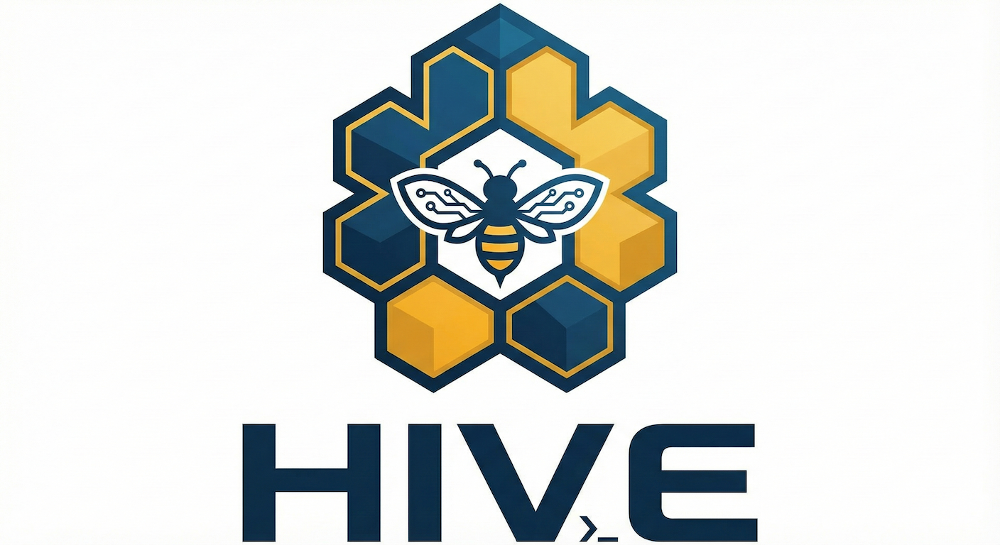

<p align="center">
  
</p>

<h1 align="center">Hive</h1>

<p align="center">
  <strong>A Python framework for building terminal-agent-native applications</strong>
</p>

<p align="center">
  Define once. Generate CLI, TUI, and Python API.
</p>

<p align="center">
  <a href="https://github.com/yourusername/hive/actions"></a>
  <a href="https://pypi.org/project/hive-framework/"></a>
  <a href="https://pypi.org/project/hive-framework/"></a>
  <a href="https://github.com/yourusername/hive/blob/main/LICENSE"></a>
  <a href="https://discord.gg/yourinvite"></a>
</p>

---

## What is Hive?

Hive is a framework for building Python applications that serve three audiences from a single codebase: command-line interfaces for terminal-native AI agents and power users, terminal user interfaces for interactive human use, and Python APIs for programmatic integration.

Write your application logic once using decorated Python functions. Hive generates consistent interfaces across all access patterns, ensuring that your CLI, TUI, and Python API always stay in sync.

```python
from hive import App, command, query, entity
from sqlmodel import Field, SQLModel

app = App(
    name="tasks",
    cli_command="tasks",
    tui_title="Task Manager",
)

@entity(app)
class Task(SQLModel, table=True):
    id: int | None = Field(default=None, primary_key=True)
    title: str
    completed: bool = False

@command(app, entities=[Task])
async def add(ctx, title: str) -> Task:
    """Add a new task."""
    task = Task(title=title)
    ctx.db.add(task)
    await ctx.db.commit()
    return task

@query(app, entities=[Task])
async def list(ctx, all: bool = False) -> list[Task]:
    """List tasks."""
    q = select(Task) if all else select(Task).where(Task.completed == False)
    return await ctx.db.exec(q)
```

From this single specification, Hive generates a complete CLI with `--json` output for agents, a Textual-based TUI with keyboard navigation and command palette, and an importable Python API with full type safety.

---

## Why Hive?

Modern terminal applications increasingly serve multiple audiences. A data toolkit might be invoked by an AI agent through structured CLI commands, explored interactively by a human through a TUI, and integrated programmatically through Python imports. Building and maintaining three consistent interfaces manually is tedious and error-prone.

Hive solves this by treating your decorated Python code as a specification from which all interfaces are derived. Change a command's signature once, and the change propagates everywhere. Add a new command, and it appears in the CLI, the TUI command palette, and the Python API automatically.

The framework is designed for the emerging category of "terminal-agent-native" software—applications built to be consumed by AI agents operating through shell access (like Claude Code's bash tool) while remaining fully accessible to human users.

---

## Features

**Triple Interface Generation** — Every command you define becomes a CLI subcommand, a TUI action, and a Python function. All three interfaces share the same types, documentation, and behavior.

**CLI-First Design** — Commands support `--json` output for machine parsing, work headlessly without interactive prompts, and follow Unix conventions for composition and scripting.

**Beautiful Terminal UI** — Full Textual integration with screens, widgets, keyboard navigation, and a searchable command palette exposing all commands.

**Type-Safe Data Layer** — SQLModel integration provides Pydantic validation and SQLAlchemy ORM capabilities. Your models are simultaneously schemas and database tables.

**Specification Export** — Export your application's specification as JSON Schema for documentation, validation, or cross-language consumption.

**Optional Extensions** — Generate MCP servers for non-terminal AI agents or REST APIs via FastAPI when you need to extend beyond the terminal.

---

## Installation

Hive requires Python 3.11 or later.

```bash
pip install hive-framework
```

To include optional dependencies for MCP server or REST API generation:

```bash
pip install hive-framework[mcp]      # Include FastMCP
pip install hive-framework[rest]     # Include FastAPI
pip install hive-framework[all]      # Include everything
```

---

## Quick Start

Create a new Hive project:

```bash
hive new myapp
cd myapp
```

This generates a project structure with a sample application. Start the development server:

```bash
hive dev
```

The development server runs your CLI and TUI with hot reload. Try the generated commands:

```bash
# CLI usage
myapp hello World
myapp hello World --json

# TUI usage
myapp --tui
```

---

## Project Structure

A Hive project follows this structure:

```
myapp/
├── pyproject.toml
├── src/
│   └── myapp/
│       ├── __init__.py
│       ├── app.py           # App definition and decorators
│       ├── models.py        # SQLModel entities
│       ├── commands/        # Command implementations
│       ├── screens/         # TUI screens (Textual)
│       └── services/        # External API clients
└── tests/
```

The `app.py` file defines your application and serves as the central specification:

```python
from hive import App

app = App(
    name="myapp",
    version="0.1.0",
    description="My application",
    cli_command="myapp",
    tui_title="My Application",
    database="sqlite:///~/.myapp/data.db",
)
```

---

## Defining Commands

Commands are async functions decorated with `@command`. They represent actions that may modify state or interact with external systems.

```python
from typing import Annotated
from hive import command
from hive.types import Argument, Option

@command(app, entities=[Project, Event])
async def export(
    ctx,
    project_id: Annotated[int, Argument(help="Project ID")],
    start: Annotated[date, Option("--start", "-s", help="Start date")],
    end: Annotated[date, Option("--end", "-e", help="End date")] = None,
) -> ExportResult:
    """
    Export event data for a project.
    
    Downloads events for the specified date range and stores them
    in the local database.
    
    Examples:
        myapp export 123 --start 2024-01-01
        myapp export 123 -s 2024-01-01 -e 2024-01-31 --json
    """
    # Implementation here
    ...
```

This single definition generates:

**CLI**: `myapp export 123 --start 2024-01-01 --json`

**TUI**: Accessible via command palette (Ctrl+P), with a parameter input modal

**Python API**: `await export(project_id=123, start=date(2024, 1, 1))`

---

## Defining Queries

Queries are read operations that retrieve data without side effects. They support caching and are optimized for repeated execution.

```python
from hive import query

@query(app, entities=[Event], cache_ttl=300)
async def events(
    ctx,
    project_id: int,
    event_name: str | None = None,
    limit: int = 100,
) -> list[Event]:
    """Query events from local database."""
    q = select(Event).where(Event.project_id == project_id)
    if event_name:
        q = q.where(Event.name == event_name)
    return await ctx.db.exec(q.limit(limit))
```

The `cache_ttl` parameter enables response caching. Cached results are invalidated when commands targeting the same entities execute.

---

## Defining Screens

Screens define TUI views using Textual. The `@screen` decorator registers them for navigation.

```python
from textual.app import ComposeResult
from textual.screen import Screen
from textual.widgets import Header, Footer, DataTable
from hive import screen

@screen(app, default=True, keybinding="d")
class DashboardScreen(Screen):
    """Main dashboard."""
    
    BINDINGS = [("r", "refresh", "Refresh")]
    
    def compose(self) -> ComposeResult:
        yield Header()
        yield DataTable(id="data")
        yield Footer()
    
    async def on_mount(self) -> None:
        data = await self.app.queries.events(project_id=1)
        table = self.query_one("#data", DataTable)
        # Populate table...
```

Hive provides the application shell (header, footer, command palette). You implement the screen content using standard Textual patterns.

---

## Execution Context

Commands, queries, and screens receive a context object providing access to framework services:

```python
@command(app)
async def my_command(ctx, ...) -> Result:
    # Database access
    results = await ctx.db.exec(select(MyModel))
    
    # Service clients
    data = await ctx.services.api_client.fetch()
    
    # Configuration
    setting = ctx.config.my_setting
    
    # Output formatting (respects --json flag)
    ctx.output.info("Processing...")
    
    return Result(...)
```

---

## Output Formatting

Hive automatically handles output formatting based on CLI flags. Return a Pydantic model from your command, and Hive renders it appropriately:

```bash
# Human-readable table (default)
$ myapp list
┏━━━━┳━━━━━━━━━━━━━━━━┳━━━━━━━━━━┓
┃ ID ┃ Title          ┃ Status   ┃
┡━━━━╇━━━━━━━━━━━━━━━━╇━━━━━━━━━━┩
│  1 │ Write docs     │ pending  │
│  2 │ Review PR      │ complete │
└────┴────────────────┴──────────┘

# JSON for agents and scripts
$ myapp list --json
{"tasks": [{"id": 1, "title": "Write docs", ...}], "total": 2}

# CSV for data processing
$ myapp list --format csv
id,title,status
1,Write docs,pending
2,Review PR,complete
```

---

## Optional Interfaces

By default, Hive generates CLI, TUI, and Python API interfaces. Two additional interfaces are available when needed.

### MCP Server

Enable MCP server generation to expose commands as tools for AI agents like Claude Desktop:

```python
app = App(
    name="myapp",
    cli_command="myapp",
    mcp_server=True,  # Enable MCP
)
```

Run the MCP server:

```bash
myapp-mcp
```

### REST API

Enable REST API generation for HTTP access:

```python
app = App(
    name="myapp",
    cli_command="myapp",
    rest_api=True,  # Enable REST API
)
```

Run the API server:

```bash
myapp-api
# or: uvicorn myapp.api:app --port 8000
```

OpenAPI documentation is available at `/docs`.

---

## CLI Reference

Hive provides a CLI for project management:

```bash
hive new <name>        # Create a new project
hive dev               # Start development server with hot reload
hive build             # Build distribution packages
hive publish           # Publish to PyPI

hive db migrate <msg>  # Generate database migration
hive db upgrade        # Apply pending migrations
hive db reset          # Reset database

hive spec export       # Export specification as JSON Schema
hive spec diff <a> <b> # Compare specifications between versions

hive docs generate     # Generate documentation from spec
```

---

## Technology Stack

Hive builds on a carefully selected set of libraries that share philosophical alignment:

| Component | Technology | Purpose |
|-----------|------------|---------|
| CLI | [Typer](https://typer.tiangolo.com/) + [Rich](https://rich.readthedocs.io/) | Command-line interface with beautiful output |
| TUI | [Textual](https://textual.textualize.io/) | Terminal user interface framework |
| Data | [SQLModel](https://sqlmodel.tiangolo.com/) | Type-safe ORM (Pydantic + SQLAlchemy) |
| Database | SQLite (default) | Embedded database; DuckDB and PostgreSQL also supported |
| MCP | [FastMCP](https://github.com/jlowin/fastmcp) | MCP server generation (optional) |
| REST | [FastAPI](https://fastapi.tiangolo.com/) | REST API generation (optional) |

Typer, SQLModel, and FastAPI share the same author and design philosophy: type hints drive behavior, decorators define structure, and Pydantic handles validation.

---

## Documentation

Full documentation is available at [hive.dev/docs](https://hive.dev/docs).

- [Getting Started Guide](https://hive.dev/docs/getting-started)
- [Tutorial: Building a Task Manager](https://hive.dev/docs/tutorial)
- [API Reference](https://hive.dev/docs/api)
- [Specification Format](https://hive.dev/docs/specification)

---

## Examples

The [examples](./examples) directory contains complete sample applications:

- **todo** — Simple task list demonstrating core patterns
- **api-client** — Application integrating with an external API
- **analytics** — Data analysis app using DuckDB

---

## Contributing

Contributions are welcome. Please read [CONTRIBUTING.md](./CONTRIBUTING.md) for guidelines.

The framework core is in `src/hive/`. Key areas:

- `src/hive/core/` — Specification parsing and registry
- `src/hive/generators/` — CLI, TUI, and artifact generators
- `src/hive/runtime/` — Execution context and database layer

To set up a development environment:

```bash
git clone https://github.com/yourusername/hive.git
cd hive
pip install -e ".[dev]"
pytest
```

---

## License

Hive is released under the [MIT License](./LICENSE).

---

## Acknowledgments

Hive draws architectural inspiration from [Wasp](https://wasp.sh), a full-stack web framework that generates React and Node.js applications from a declarative specification. Where Wasp targets web applications, Hive targets terminal-native applications with the same "define once, generate everywhere" philosophy.

The framework builds on excellent work by the Python community, particularly [Sebastián Ramírez](https://github.com/tiangolo)'s ecosystem (Typer, SQLModel, FastAPI) and [Textualize](https://www.textualize.io/)'s terminal tools (Rich, Textual).
